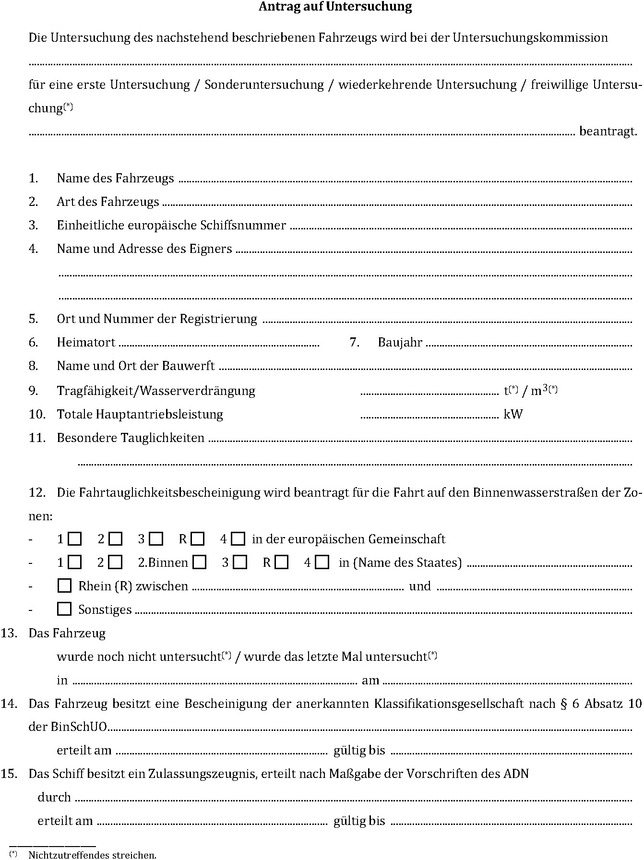
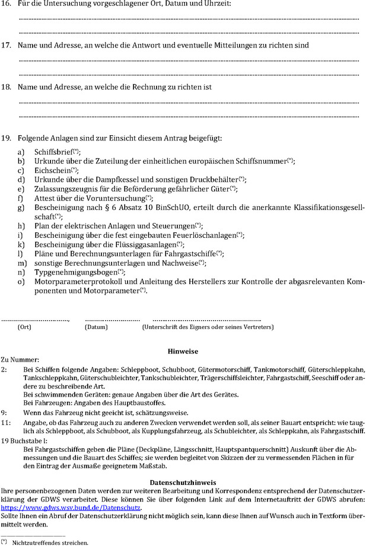
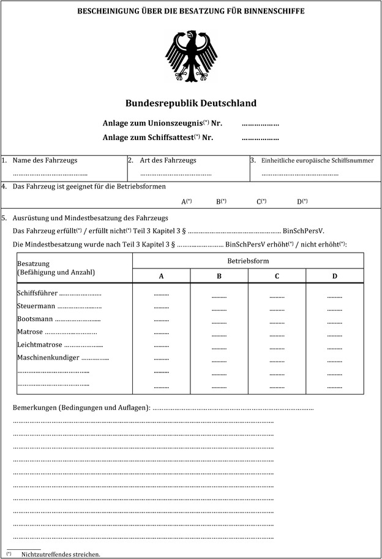
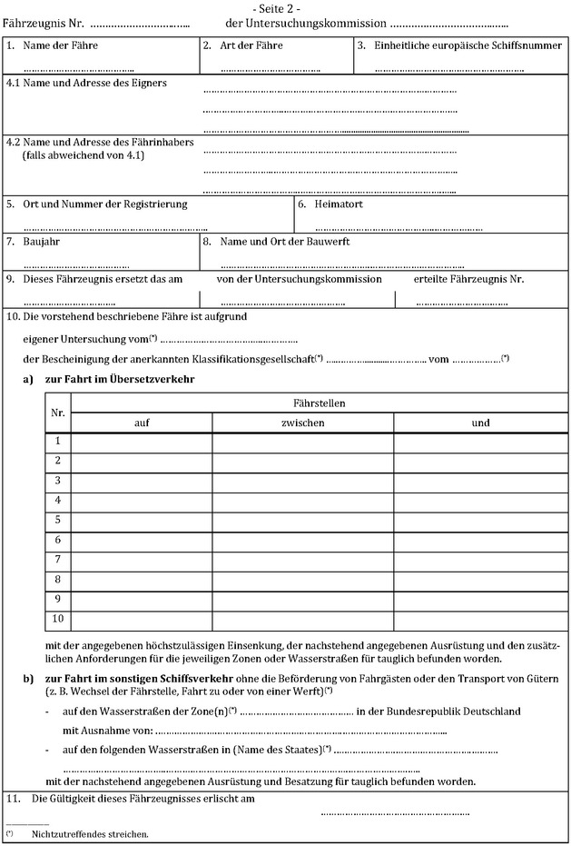
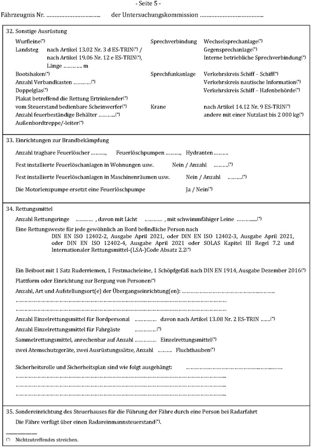
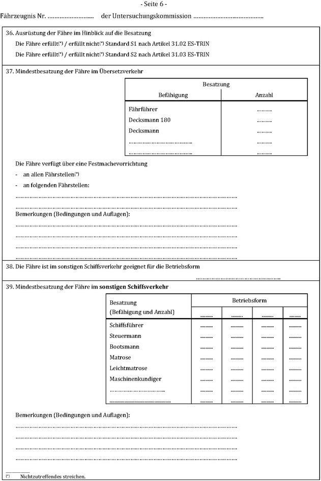
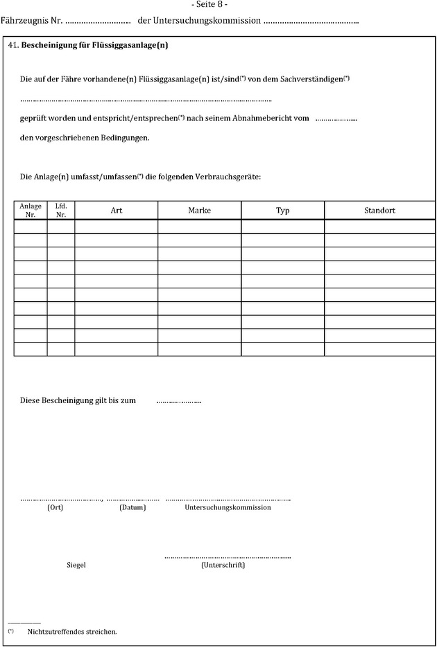
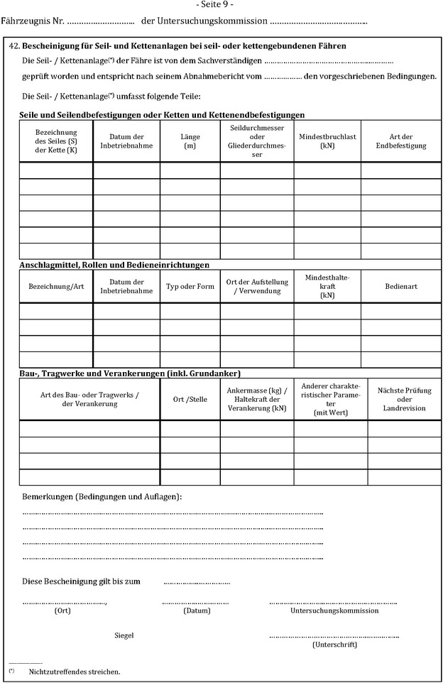
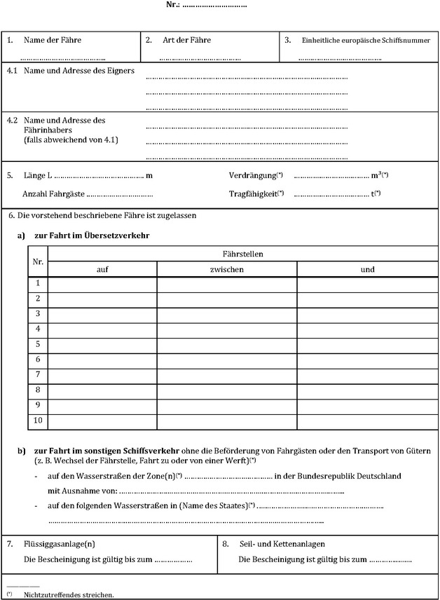
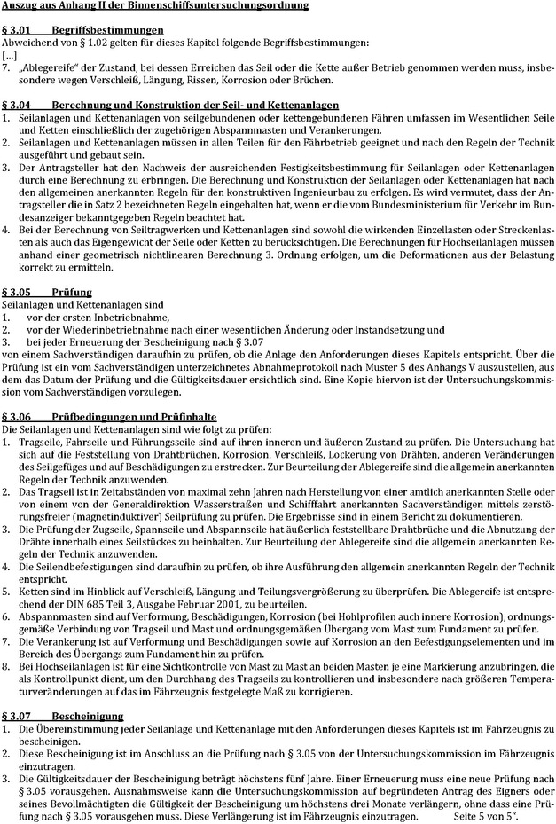

Nationale Muster
---
Title: (Anhang V der Binnenschiffsuntersuchungsordnung BGBl I 2018, 1398)
jurabk: BinSchUO2018Anh V
layout: default
origslug: binschuo2018anh_v
slug: binschuo2018anh_v

---

# (Anhang V der Binnenschiffsuntersuchungsordnung BGBl I 2018, 1398) (BinSchUO2018Anh V)

Ausfertigungsdatum
:   2018-09-21

Fundstelle
:   BGBl I: 2018, 1398, 1475

Geändert durch
:   Art. 2 Abs. 6 Nr. 11 V v. 26.11.2021 I 4982, 5204, 2023 I Nr. 144

Änderung durch
:   Art. 1 Nr. 17 V v. 14.10.2025 I Nr. 242 textlich nachgewiesen, dokumentarisch noch nicht abschließend bearbeitet

## Inhaltsverzeichnis

*    *   Muster 1

    *   Muster des Antrags auf Untersuchung

*    *   Muster 2

    *   Muster der Bescheinigung über die Besatzung für Binnenschiffe

*    *   Muster 3

    *   Muster des Fährzeugnisses

*    *   Muster 4

    *   Muster des vorläufigen Fährzeugnisses

*    *   Muster 5

    *   Muster des Abnahmeprotokolls für die Prüfung der Seil- und
        Kettenanlagen von seil- und kettengebundenen Fähren

*    *   Muster 6

    *   Muster des Abnahmeprotokolls für Fahrgastboote

## Muster 1 Muster des Antrags auf Untersuchung

(Fundstelle: BGBl. 2025 I Nr. 242, S. 21 – 22)

## Muster 2 Muster der Bescheinigung über die Besatzung für Binnenschiffe

(Fundstelle: BGBl. 2025 I Nr. 242, S. 23 – 24)

## Muster 3 Muster des Fährzeugnisses

(Fundstelle: BGBl. 2025 I Nr. 242, S. 25 – 34)

## Muster 4 Muster des vorläufigen Fährzeugnisses

(Fundstelle: BGBl. 2025 I Nr. 242, S. 35 – 36)

## Muster 5 Muster des Abnahmeprotokolls für die Prüfung der Seil- und Kettenanlagen von seil- und kettengebundenen Fähren

(Fundstelle: BGBl. 2025 I Nr. 242, S. 37 – 41)

## Muster 6 Muster des Abnahmeprotokolls für Fahrgastboote

(Fundstelle: BGBl. I 2018, 1499 - 1502)

